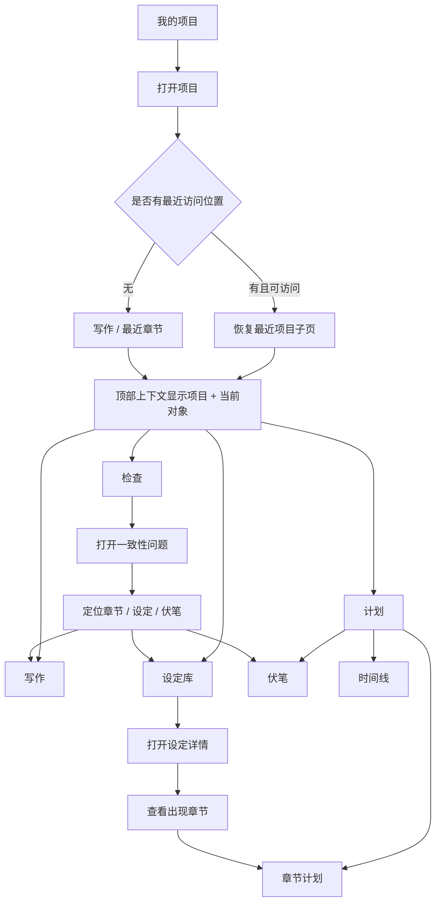

# `DES-001` 核心创作工作台信息架构与状态规范

## 0. 基本信息

- 任务编号：`DES-001`
- 文档版本：v1.0
- 日期：2026-07-30
- 当前状态：`REVIEW`
- 主负责人：网站设计者
- 协作 Agent：核心开发者 `/root/dev001_baseline`
- 页面或模块：项目内核心创作工作台
- 用户场景：作者在同一小说项目内持续管理设定、章节、伏笔、故事时间和一致性问题，并在移动端完成查看、轻量编辑与问题处理
- 依赖：`PM-002` 的最终术语；实现依赖 `BUG-001`、`DES-002` 以及 M1–M3 对应开发任务
- 可参考的现有实现：
  - `frontend/src/App.tsx`
  - `frontend/src/pages/ProjectDetail.tsx`
  - `frontend/src/components/WorldviewEditor.tsx`
  - `frontend/src/components/OutlineReview.tsx`
  - `frontend/src/components/ChapterWriter.tsx`
  - `frontend/src/components/ProgressPanel.tsx`

### 0.1 背景与目标

现有项目详情页以“世界观 → 大纲 → 章节生成”三步状态切换组织内容，适合首次创建，但无法承载长篇创作中的反复跳转、跨章节核对和长期维护。移动端在 `≤768px` 时隐藏全局侧栏且没有替代导航，核心页面不可稳定到达。

本任务把项目内体验定义为可反复进入的“创作工作台”，而不是一次性向导。目标是：

1. 桌面和 390px 移动端均可到达写作、设定库、章节计划、伏笔、时间线和一致性报告；
2. 用户始终知道当前项目、当前章节或当前设定；
3. 高频操作采用创作者术语，不暴露数据库、Prompt、模型上下文等技术概念；
4. 尚未具备数据能力的入口明确说明阶段和解锁条件，不伪装可用；
5. 为后续设定库、章节计划和一致性闭环提供稳定的路由、组件与状态基线。

### 0.2 本任务不包含

- 完整品牌重设计；
- 社区、排行、关注、评论等功能扩张；
- 具体领域表结构、API 或代码实现；
- 关系图谱、版本对比和一致性算法的详细交互；
- 多人实时协作；
- 删除或淘汰现有核心页面、组件与数据。

## 1. 设计原则

1. **项目先于功能**：进入工作台后，项目名是最高层上下文；功能导航始终隶属于当前项目。
2. **反复编辑而非线性通关**：世界观、大纲和章节不再表现为只能向前的三步；完成状态用于提示，不阻止返回修改。
3. **计划与正文分离**：AI 生成的大纲或建议必须标为“建议”，用户确认后才进入章节计划。
4. **事实与问题可追溯**：设定、计划、正文和检查结果之间提供来源跳转；不把 AI 建议显示为已确认事实。
5. **能力诚实**：入口可以为信息架构预留，但未接入 API 时只能显示“规划中”或“完成前置步骤后可用”。
6. **移动端聚焦单任务**：390px 不压缩桌面多栏，而是一次显示一个主要任务，通过页面、抽屉和底部导航切换。

## 2. 信息架构

### 2.1 页面层级

```text
我的项目
└── 当前项目
    ├── 写作
    │   ├── 章节列表
    │   └── 章节编辑 / 生成
    ├── 设定库
    │   ├── 全部设定
    │   ├── 世界观
    │   ├── 角色 / 场景 / 阵营 / 物品
    │   ├── 冲突 / 事件 / 规则
    │   ├── 伏笔（全局查找与关联）
    │   └── 自定义要素
    ├── 计划
    │   ├── 章节计划
    │   ├── 伏笔
    │   └── 时间线
    ├── 检查
    │   ├── 待处理
    │   ├── 已处理
    │   └── 已忽略
    └── 项目设置
```

“伏笔”和“时间线”在信息结构上属于计划，但桌面项目导航保留直达子项；移动端通过“计划”页的顶部分段控件直达，并在“更多”抽屉提供快捷入口。

伏笔在数据层属于可引用的设定要素，因此可被设定库全局搜索、关系区和章节关联选择器发现；它的创建、埋入、强化、回收和逾期处理统一在“计划 > 伏笔”完成。两个入口展示同一对象，不复制两套数据。

### 2.2 建议路由

采用可深链的嵌套路由，页面刷新后仍保留位置：

| 目标 | 建议路由 | 备注 |
|---|---|---|
| 项目默认入口 | `/project/:id` | 重定向到最近访问且有权限的项目子页；无记录时进入写作 |
| 写作 | `/project/:id/writing` | 无章节参数时显示最近章节或章节列表 |
| 指定章节 | `/project/:id/writing/:chapterNum` | `chapterNum` 使用正整数，不以标题作身份 |
| 设定库 | `/project/:id/settings` | 这里的 `settings` 指“设定库”，最终英文路径可在实现前改为 `lore`，用户界面统一写“设定库” |
| 指定设定 | `/project/:id/settings/:settingId` | 使用稳定 ID；名称可修改 |
| 计划 | `/project/:id/plan/chapters` | 默认子页 |
| 伏笔 | `/project/:id/plan/foreshadows` | 可从章节或检查结果带筛选参数进入 |
| 时间线 | `/project/:id/plan/timeline` | 支持故事时间与章节顺序视图 |
| 一致性检查 | `/project/:id/checks` | 默认“待处理” |
| 指定问题 | `/project/:id/checks/:issueId` | 打开问题详情并保留列表上下文 |
| 项目设置 | `/project/:id/project-settings` | 避免与“设定库”中文含义混淆 |

实现前应由开发者确定 `settings` 是否改用 `lore`；一旦上线不得频繁改动。现有 `/project/:id` 可保留兼容重定向，不要求删除原组件。

### 2.3 导航优先级

- 一级高频：写作、设定库、计划、检查；
- 二级高频：章节计划、伏笔、时间线；
- 低频：项目设置、切换项目、回到项目列表；
- 不进入项目主导航：社区、管理员 API 设置；
- “新建项目”属于项目列表级操作，不在项目工作台内占据主入口。

## 3. 页面流



### 3.1 进入项目

1. 用户从“我的项目”打开项目；
2. 系统优先恢复该用户在此项目中最近访问且仍存在的子页；
3. 若目标已删除、无权限或路由非法，进入写作首页并显示非阻断说明；
4. 顶部上下文栏显示项目名及当前对象；
5. 桌面项目导航和移动底部导航同时标记当前一级位置。

### 3.2 从设定定位章节

1. 在设定详情的“出现计划”区域查看首次出现、引用和揭示章节；
2. 点击某一章节，进入对应章节计划并高亮该设定；
3. 若计划功能尚未上线，显示阶段说明和当前可做动作，不生成假数据；
4. 返回时保留原设定列表筛选和滚动位置。

### 3.3 从检查结果处理冲突

1. 检查列表按严重度、类型、章节筛选；
2. 打开问题后展示“发现了什么、证据来自哪里、建议怎么处理”；
3. 用户可定位到章节、设定、伏笔或时间线；
4. 修复后重新检查；M3 前只显示功能阶段，不提供虚假的“已修复”；
5. 忽略问题必须填写或选择理由，并留下记录。

### 3.4 未满足前置条件

入口仍可到达，但落地页显示：

- 功能当前阶段；
- 缺少的前置条件；
- 可立即执行的下一步；
- 已有数据不会发生什么变化。

例如：“时间线将在章节计划启用后可用。你可以先完善章节大纲。”按钮为“前往章节计划”，而不是无说明的灰色按钮。

## 4. 桌面布局规范

### 4.1 项目外壳

适用宽度：`≥769px`。

| 区域 | 尺寸 | 内容 |
|---|---:|---|
| 项目导航 | 固定 `240px`，最小高度 `100vh` | 返回项目、项目切换器、核心导航、项目设置、账户入口 |
| 顶部上下文栏 | 高 `64px`，内容区内吸顶 | 面包屑、当前对象、保存状态、页面级操作 |
| 主内容区 | `calc(100vw - 240px)` | 路由内容；左右内边距 `24px`（≥1440 时 `32px`） |
| 内容最大宽度 | 普通表单 `1120px` | 长文编辑器可使用全宽工作区 |

不叠加“全局侧栏 + 项目侧栏”两套固定栏。现有侧栏应渐进演进为上下文感知的单一侧栏：项目外显示全局导航，项目内显示项目导航，并提供明确的“返回我的项目”。

### 4.2 项目导航

- 顶部 `64px`：品牌缩略标识和“我的项目”返回入口；
- 项目切换器：高 `48px`，显示项目名，单行截断，展开后搜索项目；
- 主导航项：高 `44px`，图标 `20px`，标签 `14px`，左右内边距 `12px`；
- 当前项：背景、文字权重和左侧 `3px` 标记同时变化，不能只依赖颜色；
- “检查”可显示计数徽标，最大显示 `99+`，没有真实 API 时不显示模拟数字；
- “规划中”入口使用文本标签，不使用锁图标冒充权限限制；
- 底部：项目设置和用户菜单，与创作导航视觉分组。

### 4.3 顶部上下文栏

左侧采用可操作面包屑：

`项目名 / 一级功能 / 当前对象`

示例：

- `星河旧梦 / 写作 / 第 12 章 暗潮`
- `星河旧梦 / 设定库 / 林岚`
- `星河旧梦 / 计划 / 伏笔`

规则：

- 项目名最长占 `240px`，超出省略，悬停和聚焦显示全名；
- 当前对象是页面标题语义，不再另放重复大标题；
- 当前章节或设定不存在时显示“对象不存在”，并提供回到父级；
- 右侧保存状态固定占位，避免“正在保存/已保存”造成布局跳动；
- 页面主操作最多一个实心按钮，次要操作进入更多菜单。

### 4.4 写作工作区建议

本任务只定义外壳，不重设计编辑器：

- `≥1200px`：章节列表 `260px` + 编辑区最小 `560px` + 上下文面板 `320px`；
- `769–1199px`：章节列表 `240px` + 编辑区；上下文面板改为右侧抽屉；
- 编辑区正文行宽建议 `68–76` 个中文字符，默认字号 `16px`、行高 `1.8`；
- 章节列表和上下文面板独立滚动，顶部上下文栏保持可见；
- 生成内容出现时不抢夺编辑器焦点，不按每个流式片段向读屏器播报。

## 5. 390px 移动布局规范

### 5.1 固定区域

适用宽度：`≤768px`；390px 为验收基准。

| 区域 | 尺寸 | 规则 |
|---|---:|---|
| 移动顶栏 | 高 `56px` | 返回、项目/当前对象标题、更多操作 |
| 主内容 | 左右内边距 `16px` | 单列；底部至少预留 `calc(80px + env(safe-area-inset-bottom))` |
| 底部主导航 | 可视高 `64px` + 安全区 | 写作、设定、计划、检查 |
| 底部导航项 | 最小宽高 `64 × 48px` | 图标 `22px`，标签 `11–12px` |
| 抽屉/底部面板 | 最大高 `85dvh` | 圆角 `16px 16px 0 0`，内部可滚动 |

移动顶栏标题分两行时总高度仍保持 `56px`：第一行项目名 `12px`，第二行当前章节/设定 `15px`，均单行省略。点击标题打开项目上下文抽屉，可查看全名与切换项目。

### 5.2 底部导航

固定四项：

1. 写作
2. 设定
3. 计划
4. 检查

“计划”页顶部使用 `章节计划 / 伏笔 / 时间线` 三段切换；“更多”按钮放在顶栏，抽屉包含：

- 伏笔直达；
- 时间线直达；
- 项目设置；
- 返回我的项目；
- 用户与退出。

四个底部主项不随页面动态更换，防止肌肉记忆失效。最终名称以 `PM-002` 批准术语为准。

### 5.3 移动端任务切换

- 写作页一次只显示编辑器；章节列表从左侧全屏面板打开，上下文从底部面板打开；
- 设定库先显示列表，点击进入独立详情页，不使用桌面分栏硬压缩；
- 章节计划、伏笔、时间线是三个独立路由，分段控件只负责导航；
- 检查列表进入问题详情后，系统返回键回到原筛选结果；
- 页面切换前若有未保存修改，显示明确的保留、放弃或继续编辑选项；不得静默丢失。

## 6. 模块页面目标与核心内容

| 模块 | 页面目标 | 首屏必须出现 | 主要操作 |
|---|---|---|---|
| 写作 | 编写、生成、保存当前章节 | 章节身份、保存状态、正文、相关计划摘要 | 保存、生成/停止、打开章节列表 |
| 设定库 | 查找并维护项目事实 | 搜索、类型筛选、设定列表/空状态 | 新建设定、打开详情、导入 |
| 章节计划 | 管理章节目的与要素出现 | 章节序号、标题、摘要、绑定数、冲突标记 | 编辑计划、绑定设定、确认 AI 建议 |
| 伏笔 | 管理埋入到回收的生命周期 | 状态、埋入章、计划回收章、当前风险 | 新建、强化、计划回收、标记实际回收 |
| 时间线 | 对照故事时间和章节顺序 | 视图切换、事件、故事时间、章节来源 | 新增事件、定位章节、查看冲突 |
| 检查 | 解释和处理一致性问题 | 严重度、类型、证据、状态 | 定位、重新检查、修复后确认、忽略 |

### 6.1 能力阶段标识

| 功能 | 当前原型能力 | M0 导航呈现 | 计划启用阶段 |
|---|---|---|---|
| 写作 | 已有章节列表、编辑、SSE 生成 | 可用，复用 `ChapterWriter` | M0 持续可用 |
| 设定库 | 只有世界观 JSON 大对象编辑器 | 入口可达；显示“现有世界观资料”过渡内容，不声称独立设定已上线 | M1 |
| 章节计划 | 已有大纲与章节摘要 | 可用过渡视图；AI 大纲标“建议/待确认” | M2 完整启用 |
| 伏笔 | 有内存方法和统计字段，无独立 CRUD/API | 规划状态页，说明依赖章节计划 | M2 |
| 时间线 | 有内部记忆数据，无用户 API | 规划状态页，说明依赖事件与章节计划 | M2 |
| 一致性检查 | 有未接入 UI 的检查器，无报告 API | 规划状态页，不显示模拟检查结果 | M3 |

这里的“入口可达”是指用户能到达具有明确阶段说明的落地页，不代表功能已经实现。

## 7. 组件清单

### 7.1 外壳与导航

- `ProjectShell`：项目内嵌套路由、断点和跳过导航入口；
- `ProjectNav`：桌面项目导航；
- `ProjectSwitcher`：项目名与项目切换；
- `ContextHeader`：项目、一级功能、当前对象和保存状态；
- `MobileBottomNav`：移动四项主导航；
- `MobileContextSheet`：项目上下文和低频入口；
- `PlanSubnav`：章节计划、伏笔、时间线；
- `Breadcrumbs`：桌面可操作面包屑；
- `UnsavedChangesGuard`：离开前提示；
- `SkipLink`：键盘跳到主内容。

### 7.2 通用内容

- `PageHeader`：页面标题、说明、主操作；
- `SearchField`、`FilterBar`、`FilterChip`；
- `EntityList` / `EntityCard`；
- `ChapterList` / `ChapterRow`；
- `StatusBadge`：草稿、已确认、待回收、冲突等，图标/文本与颜色组合；
- `CountBadge`；
- `SaveStatus`：正在保存、已保存、保存失败、离线草稿；
- `StageNotice`：规划中或依赖未满足；
- `RouteState`：统一加载、空白、错误、禁用、成功和冲突容器；
- `InlineAlert`、`Toast`；
- `ConflictPanel`；
- `ConfirmDialog`；
- `BottomSheet` / `SidePanel`；
- `Skeleton`；
- `Pagination`；数据规模明确后再考虑虚拟列表。

### 7.3 复用与迁移

- 复用现有 `ProtectedRoute`、项目加载/刷新逻辑；
- `WorldviewEditor` 暂时挂载在设定库过渡页；
- `OutlineReview` 暂时挂载在章节计划过渡页；
- `ChapterWriter` 和 `ProgressPanel` 进入写作路由；
- 不要求删除 `ProjectDetail`；先将其职责收敛为 `ProjectShell` 或兼容重定向；
- 通用状态不能继续散落为纯文本 `加载中...`，应由 `RouteState` 统一语义与布局。

## 8. 状态规范

### 8.1 全局规则

- 路由级状态替换主内容但保留导航和项目上下文；
- 区块级状态只替换对应区块，不能让整个页面闪白；
- 已输入内容在请求失败时保留；
- 状态必须说明“发生了什么”和“用户下一步能做什么”；
- 同一时间只显示一个主恢复动作；
- 成功提示不遮挡保存状态、正文和移动底部导航。

### 8.2 状态矩阵

| 状态 | 呈现 | 主操作 | 禁止行为 |
|---|---|---|---|
| 初次加载 | 保留外壳；标题和内容使用与真实布局一致的骨架；移动端不遮挡底栏 | 无 | 不显示虚构名称、数量或检查结果 |
| 局部加载 | 按钮内进度 + 受影响区块骨架/进度 | 可取消时显示“停止” | 不冻结整个页面 |
| 空白 | 简短说明价值、为什么为空、一个主操作；可附示例但标明“示例” | 如“创建第一个角色” | 不把空白误报为错误 |
| 可恢复错误 | 内联错误，保留旧数据和输入 | “重试” | 不清空表单、不自动循环请求 |
| 页面不存在/无权限 | 明确区分不存在与无权限；不泄露无权对象细节 | “返回上一级” | 不用无限加载代替 |
| 禁用/依赖未满足 | 控件旁写原因；入口落地页列出解锁条件 | “前往完成前置步骤” | 不只显示灰色、锁图标或 tooltip |
| 规划中 | `StageNotice` 展示预计里程碑与当前替代路径 | 前往已有相关功能 | 不出现可点击的假编辑器 |
| 操作成功 | 就地更新 + 3–5 秒非阻断 toast；保存类同时更新固定保存状态 | 必要时“查看” | 不只靠颜色、不强制跳页 |
| 生成中 | 显示当前章节、阶段、可停止；正文流式更新 | “停止生成” | 不允许重复开始同一任务 |
| 部分生成失败 | 保留已生成片段并标记未确认 | “从失败处重试”或“保留草稿” | 不覆盖用户已有正文 |
| 自动保存中 | 顶栏固定位置“正在保存…” | 无 | 不弹 toast 干扰写作 |
| 自动保存成功 | “已保存 · HH:mm” | 无 | 不造成布局跳动 |
| 自动保存失败 | “未保存”常驻警示，保留本地草稿 | “重试保存” | 不显示“已保存”、不丢本地输入 |
| 离线草稿 | “已保存在此设备，尚未同步” | “重新同步” | 不承诺已存到云端 |
| 409 版本冲突 | 阻断覆盖；显示服务器版更新时间和本地修改存在 | “查看差异”“重新加载” | 不静默采用任一版本 |
| 业务一致性冲突 | 问题卡列证据、影响对象与严重度 | “定位并处理” | 不把建议直接写入正文 |

### 8.3 自动保存与版本冲突

自动保存只在后端支持版本字段后启用：

1. 用户停止输入后延迟保存，输入期间不连续提交；
2. 页面顶栏固定显示 `正在保存 / 已保存 / 未保存 / 本地草稿`；
3. 请求失败时保留本地草稿和重试入口；
4. 后端返回 `409` 时停止后续自动保存；
5. 提供“查看差异”“重新加载服务器版本”“保留本地副本”；
6. 在版本对比能力上线前，至少允许复制或下载本地文本，不能只有“覆盖”。

当前 API 没有版本/并发令牌，M0 不应承诺真正的冲突保护。

### 8.4 异步生成

- 沿用现有 SSE 与 `AbortController`；
- 开始后按钮切换为“停止生成”，并显示当前章节和阶段；
- 停止后保留已生成内容为未确认草稿；
- 离开页面时若生成仍在运行，提示停止并离开或继续等待；
- 失败信息区分网络、权限、服务配置和内容生成失败；
- 读屏器只播报阶段变化和完成/失败，不播报每段 token；
- 生成结果必须与用户已确认正文在视觉和状态上区分。

## 9. 视觉与尺寸规范

本任务沿用现有暖白、深金色和红色变量，不做品牌重设计；红色仅用于危险和错误，不作为一般强调色。

### 9.1 字体

- 界面：现有系统无衬线字体栈；
- 正文编辑：现有衬线字体栈可作为用户选项，默认不强制；
- 页面标题：`24px / 32px / 700`（移动 `20px / 28px / 700`）；
- 区块标题：`16px / 24px / 600`；
- 正文：`14px / 22px`；
- 编辑器正文：`16px / 28–30px`；
- 辅助文字：不得低于 `12px / 18px`。

### 9.2 间距与形状

- 基础间距单位：`4px`；
- 常用间距：`8 / 12 / 16 / 24 / 32px`；
- 表单控件高度：桌面 `40px`，移动至少 `44px`；
- 导航和按钮触控目标：最小 `44 × 44px`；
- 卡片内边距：桌面 `20px`，移动 `16px`；
- 卡片间距：`12–16px`；
- 圆角：输入和按钮 `8px`，卡片 `12px`，抽屉顶部 `16px`；
- 阴影只用于浮层和悬浮层级，普通内容以边框分组。

### 9.3 语义颜色

- 普通正文使用 `--text-1/--text-2`，`--text-3` 不用于关键说明；
- 主操作可使用深金色，但必须验证白字对比度；
- 错误/危险使用深红色并配图标和文本；
- 警告、成功、信息状态需新增通过对比度验证的语义 token，不直接复用品牌色表达所有含义；
- 焦点环建议 `2px solid #8b6508`，外偏移 `2px`，在深色背景上切换为高对比浅色环。

## 10. 响应式规则

| 宽度 | 导航 | 内容布局 | 浮层 |
|---|---|---|---|
| `≥1200px` | 240px 项目侧栏 | 允许三栏写作；普通页最大 1120px | 右侧上下文面板可常驻 |
| `769–1199px` | 240px 项目侧栏 | 一至两栏；辅助栏收起 | 右侧抽屉 |
| `≤768px` | 56px 顶栏 + 64px 底栏 | 单列 | 全屏面板或底部抽屉 |
| `390px` 验收基准 | 四项主导航始终可见 | 16px 页面边距；无横向滚动 | 最大 85dvh，含安全区 |

补充规则：

- 不以设备 UA 判断，使用布局宽度；
- 横屏移动设备仍按可用宽度适配，但触控目标不缩小；
- 表格在移动端改为卡片或键值列表，不要求用户横向拖动才能读到主信息；
- 软键盘弹出时，底部导航可隐藏，但保存状态与当前对象不得丢失；
- 浏览器缩放到 200% 时，桌面页允许切换成移动式导航；
- 任何断点都不能隐藏唯一入口。

## 11. 可访问性要求

1. 使用 `header`、`nav`、`main`、`aside` 等语义地标，并提供“跳到正文”；
2. 当前导航使用 `aria-current="page"`；分段导航使用链接或正确的 tab 语义，不用可点击 `div`；
3. 所有功能可用键盘完成，焦点顺序与视觉顺序一致；
4. 抽屉/对话框打开后焦点进入，`Esc` 关闭，关闭后恢复到触发器；
5. 可见焦点环不得被 `outline: none` 移除；
6. 普通文字对比度至少 `4.5:1`，大字和图形控件至少 `3:1`；
7. 状态不只靠红、金、灰区分，必须同时有文本或图标；
8. 错误信息与字段通过 `aria-describedby` 关联，焦点移到错误摘要或首个错误字段；
9. toast 使用 `aria-live="polite"`；阻断错误使用 `role="alert"`，避免重复播报；
10. 支持 `prefers-reduced-motion`，关闭非必要位移、闪烁和进度动画；
11. 拖拽不是唯一操作方式；设定绑定和章节排序同时提供菜单或键盘操作；
12. 图标按钮均有可访问名称，移动点击目标至少 `44 × 44px`。

## 12. 开发协作结论

### 12.1 开发者反馈

核心开发者确认：

- 可复用 React Router、`ProtectedRoute`、现有侧栏外壳、项目加载/刷新逻辑，以及 `WorldviewEditor`、`OutlineReview`、`ChapterWriter`、`ProgressPanel`；
- 当前 `/project/:id` 只有组件内 `activeStep`，无法深链，刷新后也不能准确恢复子页；
- `≤768px` 直接隐藏侧栏且无替代导航，是确定的移动可达性缺陷；
- 当前 API 不支持独立设定库、伏笔、故事时间线、检查报告、版本和并发令牌；
- 长列表应先做服务端分页和筛选，再按数据规模决定是否虚拟化；
- SSE 应补停止、重试和离开页保护；
- 409 冲突必须依赖后端版本字段，前端不能静默覆盖。

### 12.2 已接受并写入方案

- 接受嵌套路由优先于继续扩展单页 `activeStep`；
- 接受桌面单一上下文侧栏、移动四项底栏和更多抽屉；
- 接受 `769px` 桌面、`≤768px` 移动的 M0 最低断点；
- 接受未具备数据能力的入口必须阶段化呈现；
- 接受分页先于虚拟化；
- 接受自动保存和 409 冲突不得在无后端版本能力时伪实现；
- 接受抽屉焦点圈闭、`Esc` 关闭与焦点恢复要求。

### 12.3 未采纳或调整

- 开发者建议路由示例为 `/project/:id/{writing|settings|plan|checks}`。本设计保留此结构，并把计划拆分为可深链子路由；
- “尚未上线入口隐藏”作为备选未采纳。推荐保留可到达的阶段说明页，因为本任务需要验证完整 IA 和移动可达性；但入口必须明确标“规划中”，不能出现模拟数据或假操作；
- 现有单页 tab 仅作为过渡兼容，不作为目标结构。

### 12.4 仍需最高管理者决定

1. `PM-002` 最终批准“设定库、章节计划、检查”等术语；本设计已对 v0.1 做只读评审并判断无阻断冲突；
2. 批准“未上线核心入口保留阶段说明页，而不是完全隐藏”的分阶段策略；
3. 将嵌套路由和移动导航实现纳入 `BUG-001`，不在 `DES-001` 内修改代码。

## 13. 验收标准与自检

### 13.1 功能验收点

- [x] 信息架构包含写作、设定库、章节计划、伏笔、时间线和一致性检查；
- [x] 定义项目、章节和设定的上下文显示方式；
- [x] 定义设定到章节、检查结果到来源的跨模块流程；
- [x] 区分现有能力、过渡能力和后续里程碑能力；
- [x] 不暴露数据库、Prompt 或模型上下文等技术概念；
- [x] 不扩张社区功能。

### 13.2 视觉验收点

- [x] 提供桌面项目外壳和区域尺寸；
- [x] 提供字体、间距、控件、圆角、阴影与语义颜色要求；
- [x] 保留现有视觉变量，不做完整品牌重设计；
- [x] 关键状态不只依赖颜色。

### 13.3 交互验收点

- [x] 提供可深链路由和页面流；
- [x] 覆盖加载、空白、错误、禁用、成功、生成、保存和冲突状态；
- [x] 明确未上线能力的阶段说明和前置条件；
- [x] 定义离开未保存内容、停止生成和返回上下文行为。

### 13.4 响应式验收点

- [x] `≥769px` 可从项目导航到达所有核心入口；
- [x] 390px 可通过底部四项、计划分段和更多抽屉到达所有核心入口；
- [x] 390px 不依赖横向滚动完成主任务；
- [x] 定义安全区、软键盘、抽屉和触控目标。

### 13.5 可访问性验收点

- [x] 规定语义地标、当前页、键盘、焦点、对比度和减少动画；
- [x] 规定抽屉焦点圈闭、`Esc` 与焦点恢复；
- [x] 规定流式生成和 toast 的读屏播报策略；
- [x] 规定不以拖拽作为唯一交互。

### 13.6 协作验收点

- [x] 在方案定稿前向核心开发者发出具体可行性问题；
- [x] 收到包含依据、风险、替代方案和里程碑建议的有效回复；
- [x] 在本报告中记录采纳、调整和未采纳内容；
- [x] 核心开发者建议按分阶段能力标识进入设计评审。

## 14. 风险与下一步

### 14.1 当前风险

- `PM-002` 尚未批准，中文术语仍可能小幅调整；
- 设定库、伏笔、时间线和检查报告缺少完整 API，只能阶段化呈现；
- 现有全局侧栏与项目内导航职责混合，实施时需要先建立 `ProjectShell`；
- 现有 CSS 中存在移除焦点外观的规则，`BUG-001` 实现时必须逐项核对；
- 现有世界观和大纲对象不具备稳定关系与版本，跨模块跳转只能在 M1/M2 完整落地。

### 14.2 下一步建议

1. 最高管理者对 `DES-001` 给出 `APPROVED` 或 `CHANGES_REQUESTED`；
2. `PM-002` 锁定术语后，仅校正文案，不改变已批准的信息层级；
3. `BUG-001` 实现 `ProjectShell`、嵌套路由、桌面项目导航和移动底栏；
4. `DES-002` 在本 IA 下细化设定库列表、详情、关系和版本状态；
5. M2、M3 分别启用计划与检查入口，不用模拟数据提前伪上线。

### 14.3 是否需要管理者决定

需要。待决定事项见 12.4；本任务建议进入 `REVIEW`。

## 15. `PM-002` 网站设计者只读审查

- 审查任务：`PM-002`
- 审查角色：网站设计者
- 审查范围：`coordination/product-scope.md` v0.1 的普通作者可理解性、渐进披露和与本工作台 IA 的一致性
- 验收结论：`APPROVED`

### 15.1 结论与依据

“设定库、章节计划、首次出现、揭示、埋入、强化、回收、时间线、检查”等核心术语贴近作者任务，定义之间边界明确，可以直接支撑本工作台导航与流程。范围文档也清晰区分了 AI 建议、用户确认、计划状态和实际状态，符合工作台“事实、计划、正文、检查”分层。

“伏笔”同时是可引用的设定要素和生命周期任务，不构成产品冲突：设定库负责全局查找与关联，“计划 > 伏笔”负责埋入、强化、回收和逾期处理。本设计已明确两个入口指向同一对象。

### 15.2 渐进披露建议

以下建议不要求修改产品范围文档，作为界面文案与层级规则执行：

| 规范术语 | 默认界面表达 | 渐进披露位置 |
|---|---|---|
| 设定要素 | 设定 | 详情页解释其类型、关系和版本 |
| 稳定身份 | 不直接显示 | 链接、冲突消歧和开发诊断中使用 |
| 来源 | 创建方式 / 来源 | 详情元信息；导入时显示原文位置 |
| 关系方向和类型 | 自然语言关系句 | 关系编辑器高级区展示方向 |
| 章节绑定 | 出现计划 / 关联章节 | 设定详情与章节计划内解释计划/实际 |
| 设定版本 / 内容版本 | 历史版本 | 版本面板再区分对象类型 |
| 生成运行 | 本次生成详情 | 生成结果的“查看依据”面板 |
| 模型配置、上下文 | 不作为主界面术语 | 本次生成详情的高级信息 |
| 用户确认 | 采用建议 / 确认为正式版本 | 首次使用时解释确认后的影响 |
| 一致性问题 | 检查结果 | 详情内显示阻断、警告、提示严重度 |

“首次出现、引用、揭示”以及“埋入、强化、回收”应保留规范词，不用更模糊的同义词替换；首次操作时用一句示例或帮助说明降低学习成本。

### 15.3 风险和建议

- “场景”可能被用户理解为写作场面，也可能被理解为地点；创建时应通过字段和示例说明其包含时间、地点、参与者与目的，地点本身作为关系引用，不另造同名对象；
- “阻断”是准确的严重度，但界面必须同时说明“为什么必须处理”和“仍可执行哪些动作”；
- “设定库”与“项目设置”的中文差异清楚，英文路由不要都使用 `settings`；本设计使用 `/settings` 与 `/project-settings` 区分只是过渡建议，开发实现前应确定不易混淆的稳定路径；
- 计划与实际状态不应默认同时展开；列表优先显示偏差，详情再展开两组状态。

### 15.4 验收判断

- 核心术语可映射到普通作者任务：通过；
- 计划、事实、版本和 AI 建议边界清楚：通过；
- 与 `DES-001` 工作台导航无阻断冲突：通过；
- 高级技术概念具备可渐进披露空间：通过；
- 建议 `PM-002` 进入下一验收里程碑。
